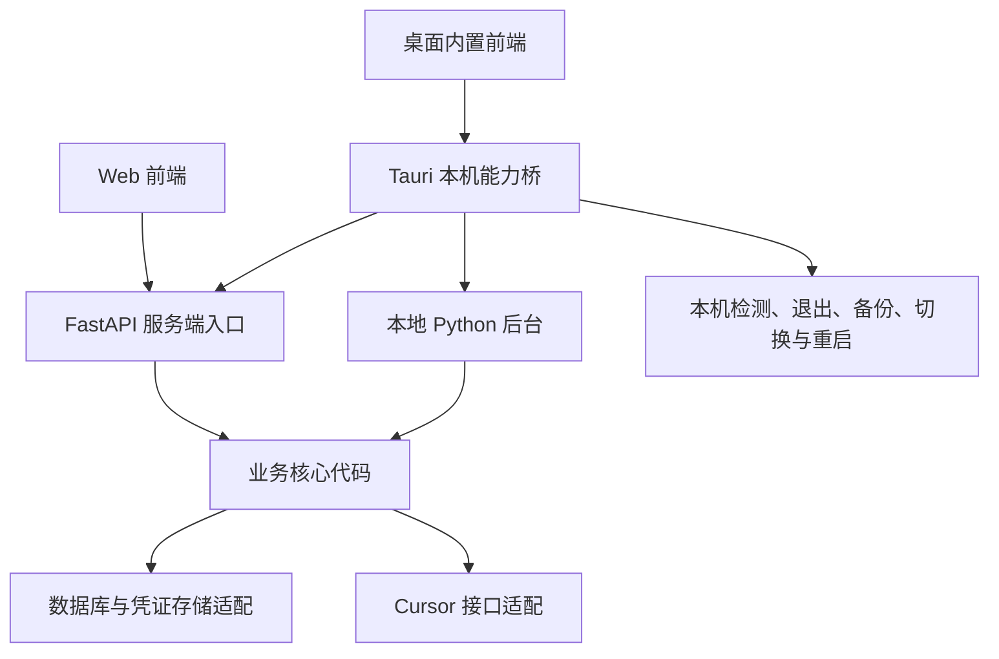

# V2 通用账号管理架构与实施计划

状态：P0、P1、P2、P3、P4 开发与阶段自动验证已完成，结果见 [P0 验证报告](p0-verification.md)、[P1 验证报告](p1-verification.md)、[P2 验证报告](p2-verification.md)、[P3 验证报告](p3-verification.md)、[P4 验证报告](p4-verification.md)；P5 连接与设备会话实现及三平台自动验证见 [P5 报告](p5-verification.md)，真实上游远程切换仍待验证；P6 发布与维护收口已完成，范围与正式发行边界见 [P6 报告](p6-verification.md)。本文描述目标设计，各阶段可用入口及边界以验证报告为准。

制定日期：2026-09-09。基线：`1.4.0` / `52d0a9255b798dce21d97efbc3739bb46d100b96`，已归档到远端 `legacy` 分支。新版在 `main` 演进，开发任务通过独立分支交付。

相关资料：[当前功能](../../README.md)、[现有实现](../maintenance.md)、[现有部署方式](../operations.md)。实施完成相应能力后，再更新这些文档中的当前行为说明。

## 1. 产品目标与范围

把当前共享登记面板演进为个人可独立使用、团队可按授权共享的账号管理工具。一套业务核心提供 Web、桌面和 CLI 入口，首个服务商继续是 Cursor。

| 使用方式 | 数据权威来源 | 身份方式 | 核心体验 |
| --- | --- | --- | --- |
| 本地桌面 | 本机数据库与凭证库 | 自动建立本地用户 | 安装后即可添加账号、查看额度和切换本机 Cursor |
| 服务端 Web | 服务端数据库 | 用户登录 | 自建服务，使用个人空间或邀请成员加入团队空间 |
| 桌面连接服务端 | 远端账号以服务端为准，本地账号以本机为准 | 登录远程实例 | 查看获授权的团队账号，并在本机执行切换 |

本地桌面运行不依赖本项目服务端；查询最新额度、授权和续期仍需连接 Cursor。离线时展示最后成功快照及其时间，不能把缓存描述成实时数据。

首轮实施包含：个人与团队空间、用户登录、固定角色、账号授权、标签、额度与明细、授权续期、本机切换、基础审计、旧版迁移、容器部署和桌面安装包。

后续再考虑：成员组与组织结构、自定义角色、SSO/OIDC、多服务商、历史趋势、PostgreSQL、多实例部署、账号借用排队、双向同步和 Linux 桌面切换。第一版不建立插件市场或微服务体系。

完整目标通过三个可独立验收的版本交付：V2 Web → V2 Desktop → V2 Connected Desktop。远程切换未通过验证前，不能把它列为已支持能力。

## 2. 已确定的架构决策

| 项目 | 决策 | 实施边界 |
| --- | --- | --- |
| 业务架构 | Python 模块化单体，FastAPI 提供 HTTP 接口 | 业务服务不依赖 HTTP Request、前端或桌面窗口 |
| 数据库 | 首版 SQLite，采用 SQLAlchemy 2 与 Alembic 管理新模型和迁移 | 分阶段替换现有 SQL，保留事务、条件更新与租约语义 |
| 前端 | Vue 3 + TypeScript + Vite | Web 与桌面共用组件、路由、API 类型和业务界面 |
| 桌面 | 优先 Tauri 2，随安装包分发 Python 后台子进程 | P0 验证打包和系统适配；无法满足验收时记录 ADR 再决定是否采用 Electron |
| 运行规模 | 服务端单实例、单业务进程；本地每个数据目录一个业务进程 | 不宣称增加 worker 即可水平扩展 |
| 数据隔离 | Workspace 是归属边界，账号 UUID 是稳定标识 | 查询、缓存、统计、租约、审计都带空间上下文 |
| 授权 | 固定空间角色 + 对成员的账号授权 | 标签不参与授权，默认无权访问其他人的资源 |
| 凭证 | 普通账号资料与加密凭证分离 | 解密仅发生在必要的服务端或本机可信执行层 |
| 同步 | 本地与远端独立管理，提供显式导入/导出 | 不自动复制远端账号到本地，不做双向凭证同步 |

### 2.1 组件与调用关系



图中的业务核心是同一份代码，在服务端和本机各运行自己的实例。桌面连接远端时，远端账号的查询和续期由远端处理，本机只运行本地账号业务及设备操作。

### 2.2 建议目录

```text
cursor_dashboard/
  domain/                    # 身份、空间、账号、角色与授权规则
  application/               # 账号、额度、凭证、切换授权等用例
  infrastructure/
    persistence/             # SQLite、仓储、事务与数据库租约
    secrets/                 # 加密及密钥访问
    providers/cursor/        # Cursor 授权、查询、续期及响应适配
  api/                       # FastAPI 路由、认证依赖、请求/响应模型
  runtime/                   # server/local 的配置、组装、调度与生命周期
  local/                     # 本机安装识别、备份和账号切换执行
  cli/                       # 面向同一用例或 API 的命令入口
frontend/
  src/                       # 共用界面、类型、API 客户端、平台能力接口
desktop/
  src-tauri/                 # 窗口、托盘、受限 IPC、子进程与系统凭证库
migrations/                  # 新版数据库版本迁移
tests/                       # 领域、权限、持久化、API 与设备适配测试
docs/plans/                  # 计划及验收记录
```

目录按里程碑逐步建立，避免一次搬迁所有文件。`server.py` 中的业务编排逐步抽入 application；现有 `sessions.py` 归入 Cursor 授权适配，避免与本项目用户会话混淆。现有 `desktop.py` 拆成 Cursor 协议处理和切换导出适配，它目前不包含桌面应用框架。

## 3. 数据模型与归属

| 实体/表 | 主要字段或约束 | 用途 |
| --- | --- | --- |
| users | UUID、登录标识、密码哈希、状态 | 使用本项目的人 |
| workspaces | UUID、personal/team、名称 | 个人或团队数据归属 |
| memberships | workspace_id、user_id、固定角色；组合唯一 | 空间成员关系 |
| invitations | 空间、受邀身份、角色、票据哈希、到期/使用状态 | 无需邮件服务也可复制邀请链接 |
| accounts | UUID、workspace_id、provider、provider_subject、邮箱、名称 | 被管理的第三方账号 |
| credentials | account_id、加密载荷、密钥版本、授权代次、凭证版本、状态与时间 | Cookie、AT/RT 等授权材料 |
| tags / account_tags | 空间内标签名称唯一、关联必须同空间 | 分类与筛选 |
| account_grants | workspace_id、account_id、membership_id、view/use；成员与账号组合唯一 | 对普通成员的显式授权 |
| usage_snapshots | workspace_id、account_id、授权代次、数据、成功/尝试时间及失败状态 | 最后成功额度快照 |
| user_sessions / device_sessions | 用户、票据哈希、到期、撤销状态；设备会话另带设备标识 | 本项目 Web 与桌面认证 |
| auth_leases | 空间、账号、租约拥有者、到期时间 | 串行化该运行实例内的上游凭证续期 |
| audit_events | 操作者、空间、资源、动作、结果、时间与 request_id | 授权和关键操作的追踪 |

具体字段类型与索引在 P1 通过模型和迁移文件固化，必须满足以下不变量：

- 每个账号只属于一个空间；创建人用于审计，不额外形成另一套所有权规则。
- 个人空间仅有本人作为 Owner；团队空间首版恰有一个 Owner，转移所有权必须在事务中完成。
- 个人账号不会因加入团队自动共享；首版暂不提供跨空间移动账号，使用明确的重新授权或导入流程。
- 新授权优先按 `(workspace_id, provider, provider_subject)` 去重。旧数据缺少 subject 时，只在同空间按规范化邮箱匹配；不能按姓名合并，也不能跨空间覆盖。
- 普通成员提交已存在账号的授权材料，不能借“同邮箱更新”覆盖其他成员管理的记录；创建/重新授权均先检查权限。
- 外键与服务层共同校验账号、标签、成员和授权属于同一空间；SQLite 连接显式开启外键约束。
- 列表、快照、明细缓存、手工操作配额和续期租约统一使用稳定 ID，不再依赖邮箱或姓名。
- 分开记录授权代次与凭证版本：重新授权使旧快照失效；正常 AT/RT 轮换保留快照，但使绑定旧凭证版本的切换票据失效。
- 额度跨账号推算仅使用当前用户可见账号的观测，不能通过全局套餐观测泄漏其他空间或未授权账号的信息；原始快照不保存由不可见账号补齐的结果。

“部门”迁移为普通标签。后续成员组表示一组用户，与账号标签独立存在。

## 4. 权限与认证设计

### 4.1 固定角色与账号授权矩阵

Owner/Admin 对本空间全部账号具有管理能力。Member/Viewer 默认没有任何团队账号权限，通过 AccountGrant 开放范围。

| 操作 | Owner | Admin | Member | Viewer |
| --- | --- | --- | --- | --- |
| 查看额度、明细与普通账号资料 | 全部账号 | 全部账号 | 获 view/use 授权的账号 | 获 view 授权的账号 |
| 手动刷新 | 可以 | 可以 | 获 use 授权的账号 | 不可以 |
| 切换到本机 | 可以 | 可以 | 获 use 授权的账号 | 不可以 |
| 新增、改资料、改标签、重新授权、删除 | 可以 | 可以 | 不可以 | 不可以 |
| 分配/收回账号授权 | 可以 | 可以，对 Member/Viewer | 不可以 | 不可以 |
| 邀请与移除 Member/Viewer | 可以 | 可以 | 不可以 | 不可以 |
| 任免 Admin、转移 Owner、删除空间 | 可以 | 不可以 | 不可以 | 不可以 |
| 查看空间操作审计 | 可以 | 可以 | 不可以 | 不可以 |
| 导出包含凭证的空间归档 | 可以 | 不可以 | 不可以 | 不可以 |

`use` 包含 `view`；Viewer 不能被授予 use，降级为 Viewer 时事务内撤销 use 能力。普通成员需要自行管理账号时，使用自己的个人空间。

“查看明细”允许按需查询上游，但仅获得额度结果；所有角色都受限流。批量凭证归档与日常切换使用不同动作，后者仍然会向本机交付登录凭证，不能承诺获 use 权限者无法提取该账号凭证。

服务端统一调用类似 `authorize(actor, action, workspace, resource)` 的授权入口。业务层接收已验证的 Actor，不能信任请求体中的 user_id/role。资源不存在与不可见时统一返回不泄漏存在性的响应；已可见资源的禁用动作可以返回 403。

查询必须先限定可见资源，再做搜索、分页、标签统计及总数统计。前端获取 capabilities 显示操作入口，后端对每次实际操作重新鉴权。

后台调度使用显式的系统执行上下文，按空间和账号执行限定任务，不提供用户可指定的 bypass 参数。CLI、桌面与 HTTP 共用授权用例；运维恢复命令另行定义，不能成为普通业务接口。

### 4.2 三种身份入口

- **服务端 Web**：首次初始化创建实例管理员及其个人空间；默认关闭公开注册，通过邀请建立用户和团队成员关系。密码用成熟实现的 scrypt 或 Argon2id，服务端保存随机会话票据的哈希，Cookie 使用 HttpOnly、Secure（HTTPS）与 SameSite，并保留 CSRF、登录限速和会话撤销。
- **本地桌面**：显式 local 运行配置自动建立本地用户和个人空间，通过桌面壳与后台的私有握手取得该身份。用户无需额外登录，本地 API 仍需认证；server 配置绝不继承本地免交互初始化行为。
- **连接远端的桌面**：使用系统浏览器登录远程实例，再以绑定 PKCE 的一次性授权码交换设备会话。校验 state、回调地址和授权码单次使用；设备会话可查看和撤销，长期凭证放在系统凭证库。具体回调机制在 P0/P5 的平台验证中确定。

实例管理员负责服务设置、用户启停和运行维护，在应用授权上不自动获得他人个人空间的数据访问权。持有服务器、数据库和解密密钥的运维者仍位于信任边界内；密码恢复等运维能力不能被描述为对运维者保密。

旧 `PANEL_TOKEN`、独立管理员口令和访客开放策略不会成为新版认证的旁路。管理员页面整合为空间设置与实例设置；成员退出、被移除、禁用、角色变更后，后续请求及未领取票据按最新状态判断。

## 5. 凭证、切换与桌面运行边界

### 5.1 凭证存储

- 数据库中的凭证使用经过验证的 AEAD 加密实现，绑定账号/空间标识并记录密钥版本。普通资料、API DTO、审计和日志不包含原文凭证。
- 本地由 macOS Keychain / Windows Credential Manager 等系统能力保护主密钥或会话；密钥不可用时明确进入锁定/恢复状态，不自动降级明文存储。
- 服务端主密钥通过独立的 secret 文件或部署密钥机制提供，不写入数据库、镜像或代码仓库。重启复用原密钥，不能每次生成新密钥覆盖旧配置。
- 备份恢复同时覆盖数据与密钥恢复材料；可移植归档使用单独口令加密，导入后用目标实例密钥重新加密。修改归属时重新绑定加密上下文。
- 加密保护的是静态存储，业务进程调用 Cursor 时仍能解密。丢失密钥的恢复边界在部署文档中说明。

### 5.2 桌面进程与本机操作

- 桌面始终加载安装包内的前端。远程服务器通过结构化 API 提供数据，不向具有本机能力的 WebView 注入页面或脚本。
- Tauri 管理 Python 后台的启动、健康检查、退出和崩溃提示。后台随安装包分发，用户无需安装 Python、uv 或 Node；每个数据目录通过进程锁防止重复调度。
- 使用随机回环端口和每次启动的随机密钥，密钥经私有通道传递，不进入 URL、日志或命令行。限制 Host/Origin，只接受桌面壳的受控调用；单靠 127.0.0.1 或 CORS 不作为身份验证。
- WebView 通过有限的 IPC 方法调用本机能力。远程连接限定到用户已配置实例，禁止提供任意 URL 请求桥、任意文件写入或任意 shell 执行接口。
- 前端平台接口至少包含检测 Cursor、发起切换、查询切换状态、打开备份目录。Web 环境返回对应能力不可用，并提供桌面连接指引或经授权的手工脚本入口。
- 切换执行器随安装包发布。优先复用现有 SQL 行为，将事务与 SQLite 备份通过随包 Python 的 sqlite3 实现；退出/重启由平台适配处理。保留现有脚本作为 Web 手工执行适配及行为参照。
- 切换流程固定为：验证授权与有效期 → 检查安装和目录 → 提示保存工作 → 正常退出并等待 → 创建含 WAL 的一致备份 → 事务更新 → 重启并展示可验证结果。失败不强杀、不继续覆盖；写入失败回滚，重启失败保留恢复入口。
- 同一目标 Cursor 数据目录的切换串行执行。备份含凭证，限制访问权限；默认用户目录优先，首版不承诺便携版、自定义目录或 Linux 切换。
- 应用默认关闭窗口即结束后台；用户显式开启托盘驻留后才持续刷新。休眠恢复时重新检查凭证时间并分散刷新，不一次回源全部账号。

### 5.3 远程切换票据与会话轮换

服务端确认 use 权限后签发短期、一次性切换票据，绑定操作者、空间、账号、设备会话、授权代次和凭证版本。领取时再次检查成员关系、角色、账号状态和票据有效性，并原子消费。有效期不超过 5 分钟且不超过上游 AT 到期时间。

桌面通过已认证的原生通道领取结构化凭证数据，由固定执行器完成切换；凭证不经过前端状态持久化、日志或剪贴板。失败后重新申请票据，避免把一次性票据改造成长期下载入口。Web 手工脚本使用同一授权用例与独立的短链交付适配，不允许访客凭共享口令领取。

服务端继续负责远端账号的后台刷新，桌面面板不再对该账号启动第二套续期任务。但凭证写入 Cursor 后，Cursor 本身也可能续期：**服务端数据库租约无法协调 Cursor 客户端的刷新行为。**

P0 记录该风险，P5 必须验证以下情况：一个客户端续期、服务端同时续期、多设备使用、客户端退出/撤销会话。优先采用经验证支持的独立设备会话；若上游无法隔离会话，必须形成可支持的设备数量、续期与重新授权方案并通过测试。不能只依赖服务端锁宣称问题已解决。验证未通过时，远程查看可以交付，远程切换仍标记未完成。

收回 use 权限能够阻止后续领取，不能自动撤回已经写入设备的凭证。上游撤销是不同操作，不与本项目账号删除或成员移除隐式绑定。

## 6. API、前端与运行约束

- 新业务接口使用 `/api/v1`，主要资源路径为 `/workspaces/{workspace_id}/accounts/{account_id}`，账号标识统一为 UUID。
- 引导接口只返回模式、初始化状态、版本及支持的能力；登录后 `/me` 返回身份与可访问空间，账号响应带当前用户可执行动作。
- 桌面连接前读取 API 协议版本与 capabilities。V2 首轮支持同一 API 主版本，未知可选字段可忽略；主版本不兼容时明确提示升级，不尝试执行切换。
- 每个运行实例有统一的出站节流与账号刷新去重，同时按用户/账号限制手工操作，防止一个成员耗尽共享额度查询能力。远程客户端不直接查询 Cursor 额度。
- CLI 优先调用运行中的本地/远程 API。独立本地 CLI 取得数据目录锁后使用同一业务服务，避免绕开授权、重复调度和凭证续期。
- 新前端在迁移中复用现有主题令牌与交互行为；异步响应代次、焦点恢复、弹窗滚动、文本转义与减少动态效果支持必须保留。Vue 组件稳定后替换 PanelUI 调用。
- 前端切换用户、空间、连接实例时清理对应内存查询缓存并取消旧请求；浏览器持久化仅存显示偏好，不存账号凭证或远端长期会话。
- 继续保留失败不覆盖最后成功快照、认证失败确认、限流优先、Grok 分支、上限估算标识和正常续期不清空快照等既有行为。

## 7. 旧版数据迁移与回退

`legacy` 分支归档的是源码，不能代替数据库和密钥备份。迁移使用独立命令，将旧库导入新库，首轮不让旧程序与新程序同时写同一个库。

1. 停止旧服务、CLI 和其他写入者，用 SQLite 一致性备份生成迁移源与回退副本；不能只拷贝正在使用的主库而忽略 WAL。
2. 校验源库版本与完整性，生成仅含数量、问题分类及映射状态的预检报告；不输出 Cookie、AT/RT 或真实切换命令。
3. 创建新版实例管理员，并指定其拥有的“导入的共享账号”团队空间。旧库没有可信的登记人身份，全部账号归入此空间，不根据姓名或邮箱自动分配给成员。
4. 为账号生成 UUID，建立旧整数 ID/旧快照标识到新 ID 的映射；旧部门转为空间内标签。
5. 加密导入凭证，保持授权状态和时间；导入过程不调用上游、不主动续期，避免试运行改变旧版会话。
6. 能唯一匹配账号的快照按新 ID 和授权代次导入。姓名冲突等无法唯一匹配的快照跳过并报告，账号保留、后续重新取数。
7. 不迁移 PANEL_TOKEN、旧管理员会话、临时切换链接和访客开放策略为新版授权。管理员重新设置登录与成员邀请，所有账号对普通成员默认不可见。
8. 在模拟和迁移验证环境核对账号数量、标签、快照、凭证可解密性与权限矩阵；日志仅记录元数据和校验结果。
9. 正式切换入口前保留完整回退材料。回退时停新版、恢复旧数据库副本并使用 legacy 对应程序；不让旧代码打开新库，也不假设存在反向 schema 降级。

迁移命令记录来源指纹和映射，重复执行不得生成重复账号或覆盖用户在新版的修改；目标库已有业务数据时拒绝隐式合并。提供预检、导入、验证三个明确步骤。

新版一旦开始续期，上游会话可能已经变化，恢复旧库不保证旧凭证仍有效；回退演练必须包含重新授权路径。新版产生的新增/修改数据也不会自动出现在旧库副本中。

## 8. 实施里程碑

以下勾选反映已验证的实施进度。每个阶段交付可运行结果与验证记录，再推进依赖它的阶段；P0 的桌面技术验证提前进行，完整桌面产品在 Web 核心稳定后实现。

### P0：基线与高风险技术验证

- [x] 固化 legacy 提交、现有模块行为和测试基线，记录现有失败与跳过项。
- [x] 用模拟数据建立 Tauri + Vue + 随包 Python 最小验证程序，验证 macOS/Windows 启停、端口握手、资源路径和安装产物的运行时独立性（环境边界见报告）。
- [x] 测量安装体积、空闲内存、启动时间，验证主架构平台的系统凭证库可用性；记录 Tauri 采用结论。
- [x] 梳理 Cursor 凭证续期与设备会话能力，制定后续集成验证矩阵；先用模拟响应验证自身竞争处理，真实上游行为仅用获授权的专用测试会话验证。
- [x] 确认 API 版本、角色矩阵、目录边界与数据迁移映射，以简短 ADR 记录后续有分歧的决策。

验收：安装产物在独立目录、移除开发工具 PATH 与 Python 环境变量后，能打开随包界面、启动冻结后台并干净退出；不访问真实 Cursor 数据。该检查验证运行时独立性，CI runner 本身安装有开发工具，纯净用户系统及最低系统版本另在 P4 验证。技术验证结果足以确定桌面框架，尚未证实的上游会话能力明确列出。

### P1：抽取业务核心与建立数据模型

- [x] 引入运行配置对象和组合入口，V2 核心使用显式数据库/密钥配置，旧面板保留兼容入口至 P2/P3 接入。
- [x] 建立 domain/application/repository 边界，账号、额度、明细和授权续期由独立用例编排；既有 HTTP 刷新复用查询用例。
- [x] 建立 SQLAlchemy 模型、Alembic 迁移、事务约束、UUID 与空间上下文；执行数据库升级前停止业务写入。
- [x] V2 快照、详情缓存、推算观测、续期租约及条件更新使用新标识与版本规则。
- [x] 实现凭证加密存储与密钥提供接口，覆盖密钥缺失、解密失败及恢复路径。
- [x] 实现旧库预检、导入、校验及回退说明，全部使用临时库验证。

验收：两个空间可保存相同 Cursor 邮箱且互不覆盖；正常凭证轮换保持快照；重新授权和并发删除不被旧请求覆盖；迁移重复执行不重复建档，旧库不被修改。

P1 可用入口为 `cursor-core` 运维 CLI 与 `Core` 组合对象。完整登录、邀请、授权管理和新版 HTTP 接入按 P2/P3 实施；旧共享口令不能访问 V2 核心库。运行方式见 [新核心运行与迁移](../core-operations.md)。

### P2：用户、空间与统一权限

- [x] 实现服务器首次初始化、用户登录/退出、密码更改、会话撤销及邀请加入。
- [x] 实现个人空间、团队成员和 Owner 转移规则，以及独立的实例管理员能力。
- [x] 实现固定角色、view/use 授权、capabilities 与统一授权入口。
- [x] 所有列表、单账号、统计、明细、刷新、凭证操作和切换票据路径接入授权。
- [x] 实现邀请、角色变更、授权增删、账号维护和切换领取等关键操作审计；事务内的业务变更与成功审计一并提交，外部执行结果单独记录。
- [x] 禁止旧共享口令和旧管理接口绕过新版权限；默认外部监听必须处于已配置认证的 server 模式。

验收：通过两用户、两空间、不同角色的允许/拒绝矩阵；猜测账号 ID、变更标签、修改请求中的空间 ID 均不能越权。撤销权限期间的慢请求与未领取票据不能继续交付凭证。

P2 提供独立 `cursor-api` 和本地首次管理员初始化，见[运行说明](../v2-api-operations.md)。P2 验收覆盖共用核心中的切换票据签发/原子领取；P3 已增加固定 Web 脚本交付，P5 已增加设备会话适配，生产远程切换仍关闭，普通 API 不返回裸凭证。

### P3：通用 Web 与服务端交付

- [x] 建立 Vue 共用前端与生成的 API 类型，提供登录/初始化、个人账号、团队空间、标签和成员授权界面。
- [x] 完成额度、明细、添加/重新授权、刷新、删除和凭证状态等现有核心流程。
- [x] 统一空间设置与实例设置，依据后端 capabilities 展示功能；个人使用隐藏无关团队入口。
- [x] 提供经过 use 授权的 Web 手工切换流程，复用一次性票据和固定脚本生成适配。
- [x] 提供 Dockerfile、Compose 示例、持久化数据/密钥挂载、健康检查、HTTPS 反代及备份恢复说明。
- [x] 改造 CLI 连接与认证入口，明确首版单实例支持边界，提供模拟预览数据和基础 CI。

验收：空环境通过文档启动容器并完成初始化；甲乙默认互不可见，授权后仅显示指定账号及操作；容器更新和重启保留数据；备份在新环境可恢复。此阶段可以交付 V2 Web。

P3 提供可部署 Vue Web、固定手工切换脚本与 `cursor-remote`，见 [运行与恢复文档](../v2-web-operations.md)。首次管理员继续离线初始化，网页提供操作说明；周期后台调度尚未接入，列表为最后成功快照，最新数据通过手工刷新或按需明细获取。独立桌面与远程设备会话分别见 P4/P5 验证报告。

### P4：独立桌面产品

- [x] 将 P0 验证程序接入正式前端和本地业务核心，初始化本地用户与个人空间。
- [x] 实现系统应用数据目录、单实例锁、后台健康状态、退出清理、可选托盘驻留和休眠恢复。
- [x] 基于 P0 的 Windows 首次启动约 18.8 秒样本，分段测量冷/热启动并优化，覆盖 WebView2 初始化与随包后台启动。
- [x] 实现密钥持久化、凭证锁定/恢复、离线快照和明确的错误提示。
- [x] 修复 OAuth Cookie 导入及本地校验被误报为网络错误，合成账号验证见 [Issue #2 修复记录](../archive/2026-09-16-oauth-cookie.md)。
- [x] 实现 macOS/Windows 的安装识别、退出、SQLite 一致备份、事务更新和重启，提供可见进度与失败恢复入口。
- [x] 实现显式加密导出/导入，前端不接触凭证明文。
- [x] 构建 macOS arm64/x64、Windows x64 安装包；平台不具备实际验证条件时标记未验证，不宣称支持。

验收目标：干净设备无需安装 Python/Node 即可运行；断网可看旧快照，联网可更新；默认用户目录的切换和 WAL 备份恢复通过平台测试，异常退出不遗留后台。

P4 实现与当前验证结果见 [报告](p4-verification.md)，使用方式见 [独立桌面文档](../v2-desktop-operations.md)。安装产物验证使用隔离目录并移除开发工具 PATH；真实系统退出/重启适配使用临时编译的 GUI，Cursor 数据与账号均为合成 fixture。最低系统版本、全新无开发工具设备、真实 Cursor 会话和正式签名发行未验证，不在本轮支持声明内。

### P5：桌面连接服务端

- [x] 增加实例连接管理，明确区分“本地”与各远程实例及其空间，清理连接切换后的缓存和请求。
- [x] 实现系统浏览器登录、PKCE 授权码交换、设备会话管理及撤销。
- [x] 接入远程额度 API 与 capability/version 协商，本机不重复调度远端账号。
- [x] 实现绑定用户、设备、账号及版本的一次性凭证领取，本机固定执行器消费结构化数据（仅合成环境开放，生产关闭）。
- [ ] 完成上游独立会话/共享会话的续期竞争验证，依据结果落实可支持的远程切换方案。
- [x] 验证服务离线、权限撤销、会话到期、重复领取、切换中断和协议不兼容的恢复路径（三平台自动验证通过，真实客户端验证边界见报告）。

验收：远程只读成员无法切换；获 use 权限的成员能在受支持设备切换；领取前撤销立即生效；远程凭证不进入前端持久化；已支持的多设备与续期场景有测试证据。此阶段完成 V2 Connected Desktop。

P5 实现、模拟验证和剩余事项见 [验证报告](p5-verification.md)，操作见 [连接文档](../v2-connected-operations.md)。当前可以交付远程查看与账号管理，S01–S06 真实 Cursor 会话实验尚未完成，生产 `remote_switch=false`，完整 V2 Connected Desktop 验收尚未完成。

### P6：发布与维护收口

- [x] 分别完成 Web、独立桌面、远程连接的上手文档，以及旧版迁移和回退演练记录。
- [x] 确定开源许可证，补充 LICENSE、贡献指南、问题模板与支持平台表；维护者已确定采用 MIT。
- [x] 为服务端镜像和桌面产物建立版本、校验和及可追踪构建；准备 macOS 签名/公证和 Windows 签名方案。
- [x] 首轮提供明确的手动更新流程，验证更新前备份、schema 升级失败恢复和 API 兼容提示；自动更新后续实现时必须验证签名。
- [x] 更新 README、maintenance、operations 与仓库维护指引，使当前能力与测试结果一致，保留 legacy 的版本边界。

候选交付与更新见 [发行运维](../v2-release-operations.md)，验证范围见 [P6 报告](p6-verification.md)。MIT LICENSE、包/镜像许可声明、贡献指南、问题模板和平台表已补齐，P6 计划任务已完成。签名方案已经准备，实际签名/公证另行验收，不提升为完整 V2 Connected Desktop。

验收：所有宣称支持的组合均有实际验证记录；无真实凭证、运行数据库、生成切换命令或密钥进入仓库和发布产物。发布标记对应已经完成的阶段，不能将计划项写成已完成能力。

## 9. 验证策略与完成标准

| 验证层 | 必须覆盖的行为 |
| --- | --- |
| 核心回归 | 额度口径、Grok、限流/认证分类、失败保留、续期租约与条件更新 |
| 数据与迁移 | 空库创建、版本升级、同邮箱跨空间、外键、重复导入、加密与恢复、快照映射冲突 |
| 权限与接口 | 角色矩阵、跨空间/跨账号访问、搜索与统计泄漏、会话撤销、CSRF、同邮箱覆盖拒绝 |
| 并发与票据 | 续期/删除/重新授权竞争、撤权与慢请求竞争、单次领取、设备绑定、旧版本失效 |
| Web/桌面界面 | 登录、空间切换、旧请求取消、授权按钮、离线提示、焦点与弹窗行为 |
| 平台集成 | 干净环境安装、子进程清理、系统密钥库、Cursor 退出、WAL 备份、回滚与重启 |
| 运行与交付 | 容器持久化、单实例限制、备份恢复、升级失败恢复、版本不兼容提示 |

自动化验证使用模拟上游和临时数据。当前 `unittest` 与 Node SQLite 测试作为基线；新增前端类型/构建与关键流程检查，Rust/打包测试按实际修改加入。只通过公共 SQL 测试不能替代 macOS/Windows 本机流程验证，缺平台或运行时导致的跳过必须披露。

整体完成需同时满足：

1. 个人用户安装桌面后可以独立管理自己的账号，不需要先部署服务端或建立团队。
2. 两名用户使用同一服务端时默认互不可见，授权后只获得约定的账号能力。
3. Web 与桌面的额度、授权和账号操作使用同一业务核心；桌面本机操作有独立、受限的入口。
4. 旧版账号可迁入新空间，迁移不继承共享访问，备份和回退路径经过验证。
5. 远程桌面切换的凭证交付、续期竞争、撤销边界与支持平台都有实际验证结论。

## 10. 第一批开发任务

实施从以下顺序开始，每项形成独立、可审查的变更：

1. 完成 P0 基线记录及桌面最小打包验证，确定 Tauri 路线。
2. 建立运行配置与 application 入口，先抽取只读账号列表/额度快照用例，保持现有数据口径。
3. 加入版本迁移、users/workspaces/memberships/accounts 模型、稳定 ID 和临时库迁移验证。
4. 建立统一 Actor/授权入口，以“两用户默认隔离、单账号授权后可见”为第一条完整业务链路。
5. 在该链路上推进凭证加密、修改操作与续期迁移，然后逐项完成 P1/P2 剩余任务。

各阶段的具体完成范围以任务勾选及关联验证报告为准。P0 验证程序使用模拟数据，业务重构、数据库迁移和正式桌面功能在 P1–P6 中实施。
